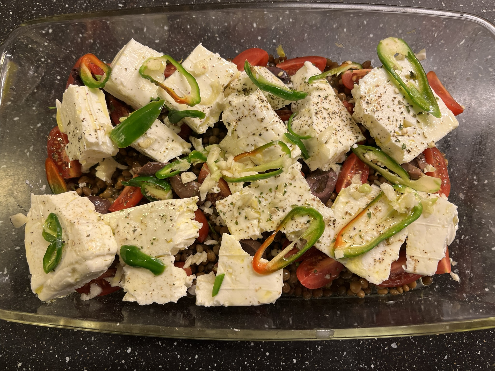

# Grilled feta cheese with couscous
### feeds 3-4 people
### Set oven to ~200C

## Ingredients
* ~230g pre-cooked lentils or beans (canned/tetra)
* ~15 cherry tomatoes
* ~10 kalamata olives
* a small handfull of chives/spring onion/garlic scapes, or any kind of green leek/onion type thing
* 300g of feta cheese
* 1-2 red spanish peppers or some other chili that you like
* 4 dl of dry couscous
* herbs: basil (fresh if you can get it)/oregano/thyme/rose mary
* 2 cloves of garlic
* olive oil

## Instructions
Cover the bottom of a oven tray/dish with the lentils (choose an oven ware that fits the amount of lentils so it just about covers the bottom)

Mince the green leek of your choice and sprinkle it over the lentils. Cut the tomatoes into quarters and add them into the tray. Remove the olive pit, cut the olives in 2 and add them with the tomatoes. Break the feta cheese into large chunks and chuck 'em in. Slice the chilis lengthwise or diagonaly into thin slices, lay the slices out on top of the cheese. 

Sprinkle the herbs of your choice over the cheese, pour vast amounts of olive oil over everything. Mince the garlic and add it on top. 

Give the tray a wiggle so some garlic/chili finds it's way down to spread it's flavor.

Put it in the oven until you get a nice golden/brown surface.

Boil equal amounts of water as couscous. Add the couscous when the water boils and remove it from the heat, add salt and some oil and let it swell with the lid on.

Serve with creamy yoghurt, especially if you chose a hotter kind of chili.

No measurements are exact, no recipe is final, please add your own touch!

