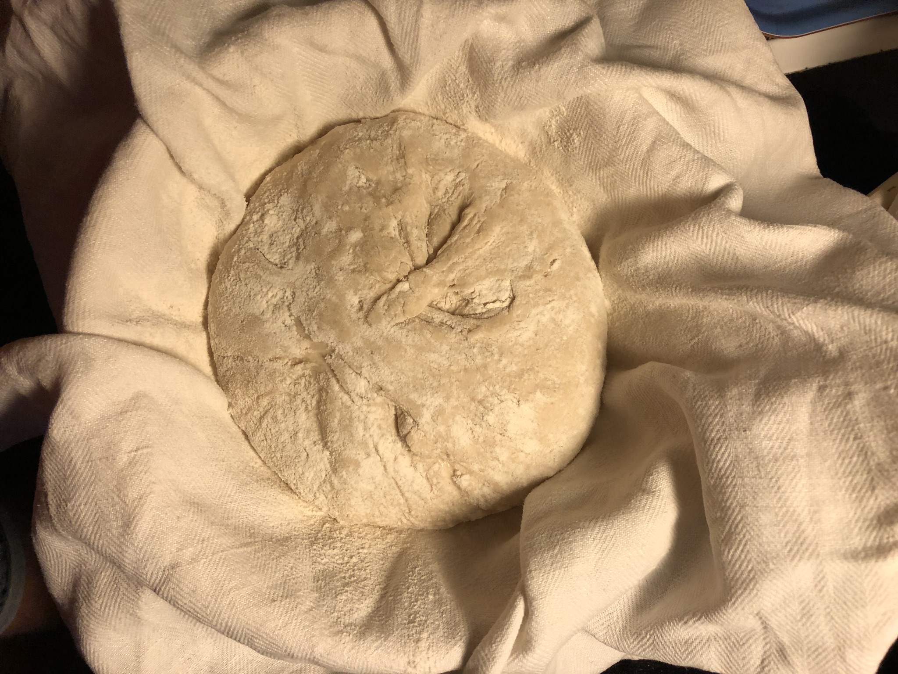

# Ingredients
* 2-3 tbs sour dough starter
* 2-3 tbs olive oil (optional)
* 2-3 tbs liquid honey (optional)
* 5-7 dl water
* 8-12 dl wheat flour
* 1-2 tbs wheat bran (optional)
* 1-2 tbs salt flakes
# Starter/pre-dough
Start by taking the sour dough starter and put it into a large bowl. Make sure you have at least one tbs of starter left to keep it going. Feed the remaining starter that's left inte jar. I usually take one dl of wheat flour (not included in the mesurements above) and enough water to make it the right texture.
In the large bowl, mix the starter with some water from the tap, I usually take cold water. Add 2 dl of wheat flour and mix it into the same texture as the starter in the jar. It should be runny, not doughey. Adjust with water as needed.  
Leave it to get bubbly for several hours. 6-10 hours is a good time. It should be really bubbly before you start baking with it.
After that, it should look something like this:

# bread dough
Add water, oil and honey.

If you want to have wheat bran in the bread, add it now. 
Add flour, a little at a time, mix with a wooden spoon or something equivalent. When the dough is almost ready to be kneaded, but still too sticky, add the salt. When you think you added enough, you should probably add a little more.

Mix. Add some more flour so it's not so sticky, then put the dough on the baking area and start kneading, adding small amounts of flour as you go. 
Start shaping the dough when it's getting smooth and make sure you stretch it as much as you can.

Get the baskets ready by lining them with cloth and then lining the cloth with flour to hinder the dough from sticking to it. 

Put the shaped dough into the basket and do some more stretch&fold. Make sure you sprinkle some more flour on top and then fold the corners of the cloth over the dough. Leave it over night (or day) to rise. Minimum 4 hours but I would say 6-12 hours is more in the lines of proper rising times.
Before rising:

After rising:

# Baking
Put the bread in the fridge for 1 hour before baking, or 20-30min in the freezer.
Set the oven to 250 degrees C with the metal baking tray in the oven. 
When the oven has reached the temperature, it's time to take the bread out. Open the corners of the cloth and cover the dough with baking paper

flip it gently and controlled so the dough ends up on the paper. 

Remove the basket and gently pull the cloth from the dough. If it sticks and pulls the dough apart, try pulling from a different direction and remember to coat the cloth with more flour next time.
Scour the bread with a sharp knife or a razor blade to control the cracking. You can do a pattern if you feel like being creative.

Take out the baking tray and slide the paper and dough onto the tray and put it back in the oven. Throw in 1 dl water on the floor/bottom of the oven and quickly close the oven door. Turn down the temp to 200C.
Let it bake for 45-60 min. The inner temp of the bread should reach 98C. 

